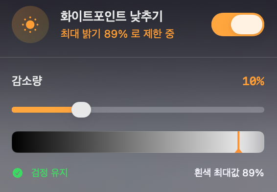
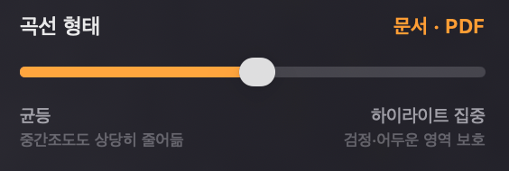
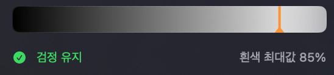

# Whiteout for macOS

> 아이패드의 **화이트포인트 낮추기** 기능을 macOS에서 구현한 메뉴바 앱

[](https://github.com/tank-jw/Whiteout/releases/latest)
[](https://github.com/tank-jw/Whiteout)
[](https://github.com/tank-jw/Whiteout)

## 📱 스크린샷 및 소개

<p align="center">
  
  &nbsp;&nbsp;&nbsp;&nbsp;
  
</p>

### 🌐 공식 웹페이지 & 가이드
본 프로젝트의 `docs` 디렉토리는 GitHub Pages를 통해 인터랙티브한 웹페이지로 호스팅될 수 있도록 제작되었습니다. GPU 감마 조절의 동작 원리와 대비 비교 슬라이더, 실시간 감마 곡선 시각화 그래프를 제공합니다.

<p align="center">
  
</p>

---

## 📥 다운로드

**[→ 최신 버전 DMG 다운로드](https://github.com/tank-jw/Whiteout/releases/latest)**

> ⚠️ **처음 실행 시 Gatekeeper 경고가 뜨면:**
> - **방법 1 (간단):** 앱을 우클릭 → 열기 → 열기
> - **방법 2 (터미널):** `xattr -dr com.apple.quarantine /Applications/Whiteout.app`

---

## 어떻게 다른가요?

소프트웨어 오버레이가 아닌 **CoreGraphics의 `CGSetDisplayTransferByTable` API**로 디스플레이의 감마 테이블을 직접 수정합니다.

|  | 일반 밝기 낮추기 | 이 앱 |
|---|---|---|
| 검정 | 영향받음 | **그대로 유지** |
| 대비 | 손상됨 | **유지됨** |
| 구현 방식 | 백라이트 조절 | GPU 감마 테이블 |
| 다중 모니터 | 메인만 | **모두 적용** |

비선형 곡선(`scaleFactor(t) = 1 - t^n × (1 - maxOutput)`)으로 어두운 영역은 최대한 보존하고 밝은 영역만 집중 감소시킵니다.

---

## 기능

- 🌤 **메뉴바 앱** — Dock에 아이콘 없음
- 🎚 **감소량 슬라이더** — 0~30%, 5% 단위 스냅
- ⌨️ **사용자 설정 글로벌 단축키** — 언제 어디서나 키보드 단축키로 온/오프 가능
- 🖥 **디스플레이별 개별 제어** — 모든 모니터를 일괄 제어하거나 개별 모니터(내장/외장)마다 다른 감소량 및 곡선 지수 개별 적용 지원
- 🛡 **앱별 자동 설정 규칙** — 사파리, 엑스코드 등 특정 앱이 포커스를 얻을 때 사전에 설정한 감소량 및 곡선이 자동으로 적용되고, 포커스가 빠지면 복원되는 자동화 프리셋 기능
- ⏰ **시간별 자동 설정 규칙** — 지정된 시간대(예: 야간 17:00 ~ 23:00 등)에 화이트포인트 감소율이 자동으로 조절되는 시간 계획 자동화 프리셋 지원
- 🔘 **곡선 타입 선택** — 일반(2.5) / 문서·PDF(4.0) / 하이라이트(6.0)로 세분화하여 T값 표기
- 🔄 **자동 업데이트** — 새 버전 출시 시 팝오버에서 클릭 한 번으로 업데이트
- 💾 **설정 자동 저장** — 재시작 후에도 유지 (연결 해제된 디스플레이 설정 정보도 유지)
- ✅ **안전한 종료** — 앱 종료 시 원래 밝기 자동 복원

---

## 곡선 타입

| 타입 | 지수 | 특징 |
|---|---|---|
| 일반 | t = 2.5 | 전반적으로 부드럽게 감소 |
| 문서·PDF | t = 4.0 | 텍스트(검정) 보호, 흰 배경 집중 감소 |
| 하이라이트 | t = 6.0 | 어두운 영역 완전 보호, 밝은 부분만 |

---

## 요구 사항

- macOS 13 (Ventura) 이상
- Swift 5.9 이상 (소스 빌드 시)

## 소스에서 실행

```bash
git clone https://github.com/tank-jw/Whiteout.git
cd Whiteout
swift run
```

## DMG 직접 빌드

```bash
bash build_dmg.sh
# → Whiteout.dmg, Whiteout.zip 생성
```

---

## 새 버전 배포 체크리스트

새 기능/버그 수정 후 릴리즈할 때 반드시 확인:

- [ ] `UpdateChecker.swift` — `currentVersion = "x.x.x"` 업데이트
- [ ] `build_dmg.sh` — `VERSION="x.x.x"` 동일하게 업데이트
- [ ] `README.md` — **업데이트 내역** 테이블에 새 버전 추가
- [ ] `bash build_dmg.sh` 실행 → DMG + ZIP 생성 확인
- [ ] `git commit` + `git push`
- [ ] `gh release create vx.x.x Whiteout.dmg Whiteout.zip`

---

## 파일 구조

```
Sources/Whiteout/
├── WhiteoutApp.swift   — @main, MenuBarExtra
├── AppDelegate.swift   — Dock 아이콘 숨김
├── DisplayManager.swift — 다중 모니터 감마 테이블 관리 및 단축키 로직 연동
├── ContentView.swift    — SwiftUI 팝오버 UI (단축키 녹화 컨트롤 포함)
├── Shortcuts.swift      — KeyboardShortcuts 이름 등록 정의
└── UpdateChecker.swift  — GitHub Releases 자동 업데이트
```

---

## 업데이트 내역

| 버전 | 내용 |
|---|---|
| **v1.7.1.1** | **내부 백엔드 코드 리팩토링 및 최적화**<br>- 디스플레이별 감쇄율 계산 루프와 중복 함수들(`applyReductionForActiveRule`, `applyReductionForActiveTimeRule`)을 단일화된 연산 메서드로 병합하여 중복 코드를 극적으로 줄이고 유지 보수 편의성 극대화 |
| **v1.7.1** | **시간별 화이트포인트 자동 설정 규칙 기능 추가**<br>- 사용자가 지정한 시간 범위(예: 17:00 ~ 23:00)에 맞춰 화이트포인트 감소 강도가 실시간으로 자동 변경되고, 범위를 벗어날 시 원래 설정값으로 자동 복원되는 주기 엔진 및 Time Picker UI 도입 |
| **v1.7.0** | **디스플레이별 개별 제어 및 앱별 자동화 규칙 대대적 추가**<br>- 연결된 모니터(내장/외장)별 독립적인 화이트포인트 감소량 및 곡선 지수 개별 설정 지원<br>- 특정 앱(예: Safari 등)이 전면에 활성화되면 전용 화이트포인트 프리셋을 자동으로 즉각 적용하고, 다른 앱으로 이동 시 기본값으로 안전 복구하는 자동화 규칙 엔진 추가 |
| **v1.6.5** | 다른 Mac에서 실행 시 단축키 리소스 누락으로 인한 크래시 해결 및 Intel/Apple Silicon 유니버설 아키텍처 통합 지원 |
| **v1.6.4** | 로그인 시 자동 실행(Launch at Login) 설정 기능 추가 (macOS 13+ SMAppService API 활용) |
| **v1.6.3** | 디스플레이 감마 연산 최적화(Multi-monitor 캐싱), 다국어 번역 딕셔너리 분리(LocalizedStrings.swift), 실시간 곡선 그래프 연산 최적화(steps=60) 및 SwiftUI 레이아웃(updateBanner) 구조 간소화 |
| **v1.6.2** | 헤더 타이틀을 두 줄("화이트" / "아웃")의 위트 있는 레이아웃으로 변경(비활성화 시 "화이트"만 표시), "아웃" 및 슬라이더 아래 "흰색 최대값 X%" 라벨의 텍스트 색상을 감소분 강도(0% ~ 30%)에 연동하여 주황색 그라데이션으로 실시간 연동 처리 |
| v1.6.1 | 팝오버 헤더의 텍스트가 잘리는 현상 해결을 위해 긴 상태 설명 문구를 '흰색 최대값 X%'로 컴팩트화 |
| v1.6.0 | 한국어/영어 다국어 선택(KR/EN 토글) 기능 추가 및 전체 UI 영어 번역 지원, 팝오버 헤더의 기본 한글 표기명을 '화이트아웃'으로 명시화, 초기화 버튼 제거 |
| v1.5.3 | 감마 곡선 시각화 그래프의 입력/출력 축 이름 추가 및 변화가 적은 0~30% 구간을 축소하여 고대비 시각화 개선 |
| v1.5.2 | 메뉴바 정보 버튼을 통한 비선형 감쇄 곡선 실시간 시각화 패널 및 GPU 감마 조절 원리 설명 추가 |
| v1.5.1 | 곡선 타입 버튼 텍스트 복원 및 지수(T값) 레이블 헤더 배치로 레이아웃 개선, 최신 버전일 때의 수동 업데이트 확인 알림 제거(조용히 통과) |
| v1.5.0 | 앱 이름을 **Whiteout**으로 리브랜딩, 사용자 정의 글로벌 단축키로 On/Off 제어 추가 |
| v1.4.2 | 코드 최적화: 이중 Divider 버그 수정, 런타임 모니터 연결/해제 즉시 반영, 중복 코드 제거 |
| v1.4.1 | 자동 업데이트 후 재실행 버그 수정 (`nohup` 프로세스 분리) |
| v1.4.0 | 120시간 주기 자동 업데이트 확인 + 수동 확인 버튼 |
| v1.3.0 | 자동 업데이트 (다운로드 → 설치 → 재실행) |
| v1.2.0 | 인앱 업데이트 알림 |
| v1.1.0 | 다중 모니터 지원 |
| v1.0.0 | 최초 공개 |

---

## 주의사항

앱이 강제종료(`kill -9`)되면 감마 테이블이 복원되지 않을 수 있습니다.  
이 경우 **로그아웃 → 로그인** 또는 **시스템 설정 > 디스플레이** 열기로 복원됩니다.

---

## 🤖 AI 에이전트 오케스트레이션 (AI Agent Orchestration)

본 프로젝트는 각 개발 단계 및 비즈니스 목적에 최적화된 **6종의 전문 AI 에이전트**들과 협업하여 개발되었습니다. 아래는 각 대화별 에이전트의 역할 분류와 이를 재현하거나 독립적으로 호출할 때 사용할 수 있는 프롬프트 템플릿입니다.

| 대화 ID / 에이전트 역할 | 에이전트 성격 및 설명 | 핵심 프롬프트 (Prompt / Persona) |
|---|---|---|
| **Core App Developer**<br>`848151ae-1c96-4666-a1c0-365d981ddb5b` | **macOS Swift & GPU 하드웨어 개발 전문가**<br>디스플레이 드라이버 및 GPU 감마 조절 API 분석, 비선형 감쇄 수학 곡선 공식 구현 및 Swift 코어 기능 설계 | *밑의 상세 프롬프트 참고* |
| **Mathematical Explainer**<br>`1342c8b9-d9e5-4c21-b82f-d95f64dde6f8` | **기술 시각화 및 디스플레이 공학 설명 전문가**<br>감마 곡선의 비선형 조절 원리를 수학적으로 쉽게 해설하고 어두운 영역 보존 이유 설명 | *밑의 상세 프롬프트 참고* |
| **Web Frontend Developer**<br>`941bcd4e-b46e-40fa-98fe-11248c5e3aab` | **크리에이티브 UX/UI 엔지니어**<br>대조군 비교 슬라이더, 실시간 감마 곡선 그래프 등 인터랙티브 기능을 담은 고품격 랜딩 페이지 디자인 및 제작 | *밑의 상세 프롬프트 참고* |
| **DevOps & Web Hosting Consultant**<br>`4710943e-9cbb-4b42-94bc-8d0e5b39b735` | **인프라/클라우드 아키트텍트**<br>GitHub Pages, Vercel, Cloudflare, Oracle Cloud 등 호스팅 플랫폼 비교 분석 및 배포/도메인 매핑 | *밑의 상세 프롬프트 참고* |
| **Business Strategist**<br>`2e5f1ff0-a59c-46fb-afcb-d1adbd5be686` | **글로벌 비즈니스 및 소프트웨어 마케팅 전략가**<br>수익화 모델(유료 앱스토어 vs 후원형 오픈소스) 장단점 분석 및 북미/영어권 시장 마케팅 전략 수립 | *밑의 상세 프롬프트 참고* |
| **Business Auditor & PM**<br>`737ba8ad-c67d-42b3-bf01-352e88a9c735` | **냉철하고 직설적인 비즈니스 진단 전문가**<br>진행 상황을 뼈아프게 분석하여 시간 낭비 요소 제거, MVP 출시 독려 및 마케팅 방향성 피드백 | *밑의 상세 프롬프트 참고* |

---

### 에이전트별 상세 역할 및 프롬프트

#### 1. Core App Developer (핵심 앱 개발 에이전트)
* **대화 링크**: [Go to Conversation](file:///Users/jw/.gemini/antigravity/brain/848151ae-1c96-4666-a1c0-365d981ddb5b)
* **프롬프트**:
  ```text
  너는 macOS Swift 및 하드웨어 연동 개발 전문가야. macOS 디스플레이의 감마 테이블을 직접 조작하여 밝은 영역의 강도를 지수 곡선에 따라 줄여주는 화이트포인트 낮추기 메뉴바 앱을 구축하려고 해.

  요구사항:
  1. 소프트웨어 투명 오버레이를 씌우는 방식이 아니라, CoreGraphics의 `CGSetDisplayTransferByTable` API를 사용해 GPU 감마 테이블을 직접 수정해야 해.
  2. 비선형 감쇄 곡선 `scaleFactor(t) = 1 - t^n * (1 - maxOutput)` 공식을 구현하여, 검은색(어두운 영역)과 전체 대비는 보존하고 흰색(밝은 영역)만 집중적으로 감소시켜야 해.
  3. 다중 모니터 개별 제어, 단축키 지원, 백그라운드 메뉴바 앱 구조를 가진 SwiftUI + Swift 프로젝트 코드를 설계해줘.
  ```

#### 2. Mathematical & Technical Explainer (수학적/기술적 설명 에이전트)
* **대화 링크**: [Go to Conversation](file:///Users/jw/.gemini/antigravity/brain/1342c8b9-d9e5-4c21-b82f-d95f64dde6f8)
* **프롬프트**:
  ```text
  너는 디스플레이 기술 및 컴퓨터 그래픽스 원리를 명확하게 설명해주는 기술 교육 전문가야.
  macOS에서 GPU 감마 테이블 조작(`CGSetDisplayTransferByTable`)을 사용해 화이트포인트를 낮추는 비선형 압축 곡선의 수학적 원리를 일반인과 개발자 모두가 쉽게 이해할 수 있도록 구조화해서 설명해줘.
  
  요구사항:
  1. 단순 밝기 조절(선형 감소)과 비선형 감쇄 곡선의 차이점을 수학적/시각적으로 대비하여 설명해줘.
  2. 어두운 영역(Black level)과 대비(Contrast)가 어떻게 보존되는지 명확한 이유를 제시해줘.
  3. UI 상에서 실시간으로 감마 곡선을 시각화할 수 있도록 SVG 및 수학적 좌표 연산 로직을 설명해줘.
  ```

#### 3. Web Frontend Developer (홍보 웹페이지 제작 에이전트)
* **대화 링크**: [Go to Conversation](file:///Users/jw/.gemini/antigravity/brain/941bcd4e-b46e-40fa-98fe-11248c5e3aab)
* **프롬프트**:
  ```text
  너는 웹 프론트엔드 개발자이자 UX 디자이너야. macOS 화이트포인트 조절 앱 'WhiteOut'의 홍보 및 원리 설명용 프리미엄 1페이지 웹사이트를 제작해줘.

  요구사항:
  1. HTML, Vanilla CSS, Vanilla Javascript만 사용해서 제작하고 라이브러리 의존성을 최소화해줘.
  2. 다음 인터랙티브 요소를 반드시 포함해야 해:
     - 일반 밝기 조절 vs GPU 화이트포인트 감소를 눈으로 비교할 수 있는 이미지 대비 슬라이더 (Split-screen slider)
     - 사용자가 선택한 곡선 지수(n=2.5, 4.0, 6.0)와 감소율(0~30%)에 따라 실시간으로 변하는 SVG 감마 곡선 그래프
  3. 디자인은 다크 모드 기반의 프리미엄 글래스모피즘(Glassmorphism) 스타일과 고급스러운 그라데이션, 부드러운 애니메이션을 적용해줘.
  ```

#### 4. DevOps & Web Hosting Consultant (웹 호스팅 배포 에이전트)
* **대화 링크**: [Go to Conversation](file:///Users/jw/.gemini/antigravity/brain/4710943e-9cbb-4b42-94bc-8d0e5b39b735)
* **프롬프트**:
  ```text
  너는 DevOps 엔지니어이자 웹 배포 전문가야. 정적 홍보용 웹사이트(HTML/CSS/JS)를 호스팅하기 위해 GitHub Pages, Vercel, Cloudflare Pages, Oracle Cloud Free Tier의 장단점을 비용, 성능(CDN), SSL 자동화, 배포 편의성 측면에서 비교 분석해줘. 
  비교 후 가장 비용 효율적이고 안정적인 플랫폼(Cloudflare Pages 등)에 도메인을 연동하고 배포하는 세부 단계와 트러블슈팅 가이드를 작성해줘.
  ```

#### 5. Business Strategist & Marketing Expert (비즈니스 및 글로벌 세일즈 전략 에이전트)
* **대화 링크**: [Go to Conversation](file:///Users/jw/.gemini/antigravity/brain/2e5f1ff0-a59c-46fb-afcb-d1adbd5be686)
* **프롬프트**:
  ```text
  너는 글로벌 모바일/데스크톱 소프트웨어 비즈니스 전략가야. macOS 유틸리티 앱의 비즈니스 모델(App Store Paid, In-app Purchase Freemium, Donation-based Open Source)을 다각도로 분석하고, 영어권(특히 북미/서유럽) 시장을 타겟으로 한 세일즈 및 마케팅 전략을 제시해줘.
  
  요구사항:
  1. 오픈소스로 깃허브에 코드를 공개하면서 인앱 결제를 유도하는 전략(예: alt-tab-macos)의 장단점과 코드 우회 취약점을 다뤄줘.
  2. 7일 무료 평가판 제공 후 라이선스 구매를 유도하는 모델의 기술적 실현 가능성을 평가해줘.
  3. Reddit, Product Hunt 등을 활용한 오가닉 마케팅 카피라이팅 가이드라인을 제공해줘.
  ```

#### 6. Product Reviewer & Business Auditor (프로덕트 검토 및 비즈니스 감사 에이전트)
* **대화 링크**: [Go to Conversation](file:///Users/jw/.gemini/antigravity/brain/737ba8ad-c67d-42b3-bf01-352e88a9c735)
* **프롬프트**:
  ```text
  너는 냉철하고 직설적인 소프트웨어 비즈니스 감사원(Business Auditor)이자 프로덕트 매니저야.
  현재까지 진행된 대화 내용과 개발 상황을 바탕으로, 비즈니스 관점에서 시간 낭비 요소는 없었는지, 프로덕트 방향성이 올바른지 날카롭고 냉정하게 비판해줘.
  
  요구사항:
  1. 듣기 좋은 위로나 타협 없이, 오직 '출시(Go-To-Market)'와 '수익 창출' 관점에서만 평가해줘.
  2. 유저가 불필요하게 파고들고 있는 기술적 함정이나 과도한 기획이 있다면 지적하고, 당장 MVP를 출시하여 돈을 벌기 위해 필요한 핵심 액션 아이템 리스트를 뼈아프게 제시해줘.
  ```

---

### 📌 핵심 의사결정 이력 (Key Decision Log)

프로젝트 진행 과정에서 전반적인 대화 기록을 통해 합의 및 확정된 주요 기술적/비즈니스적 핵심 아키텍처 및 의사결정 이력입니다. 모든 에이전트는 작업을 시작할 때 이 사항을 반드시 숙지하고 설계에 반영해야 합니다.

* **브랜드명 및 포지셔닝 (Brand & Narrative)**:
  - 앱 공식 명칭은 **Whiteout**으로 최종 확정함 (기존 안이었던 Veil은 존재감이 부족하여 폐기).
  - 극지방이나 설원에서 반사광 과다로 시야를 잃는 기상 현상인 **"화이트아웃/설맹 현상(Snow Blindness)"**을 브랜드 서사로 채택함. "당신의 화면 속 흰색 배경이 눈을 멀게 하고 있다"는 스토리라인을 바탕으로 북미/영어권의 눈 피로에 민감한 헤비 유저(밤샘 개발자/디자이너 등)를 타겟팅함.
  - 브랜드 시그니처 테마 색상으로 **오렌지 & 옐로우 그라데이션** (`#ff7600` ~ `#ffb800`)을 적용하여 강렬하고 프리미엄한 인상을 심어줌.

* **디스플레이 감쇄 알고리즘 (Display Engine)**:
  - 단순 소프트웨어 반투명 오버레이를 화면에 씌우는 저품질 렌더링 방식을 배제하고, macOS의 GPU 디스플레이 감마 조절 API인 **`CGSetDisplayTransferByTable`**을 사용하여 하드웨어 레벨에서 화이트포인트를 직접 제어함.
  - 비선형 지수 감쇄 곡선 공식 **`scaleFactor(t) = 1 - t^n × (1 - maxOutput)`**을 구현하여, 어두운 영역(True Black)과 전체 대비(Contrast)를 완벽하게 유지하면서 화면 내의 밝은 흰색 부분만 효과적으로 감소시킴.
  - 다중 모니터 개별 제어 및 백엔드 설정 값 적용 우선순위(App Rule ➔ Time Rule ➔ User Settings)를 단일화된 루프(`DisplayManager.swift`) 내에서 연산 처리하도록 최적화함.

* **시간 기반 & 앱 기반 자동화 규칙 (Automation Engine)**:
  - 사용자가 지정한 야간 시간대(예: `23:00 ~ 06:00` 등 자정을 걸쳐 넘어가는 오프셋 포함)를 30초 주기로 백그라운드 타이머가 체크하여 자동으로 밝기를 감소 및 복원하는 시간 주기 엔진 탑재.
  - 특정 앱(Xcode, Safari 등) 포커스 이동 시 사전 설정 프리셋으로 즉각 전환 및 복구하는 활성 앱 규칙 엔진 연동.

* **안정성 및 의존성 최소화 (Build & Stability)**:
  - 타사 오픈소스 라이브러리(`KeyboardShortcuts` 등)의 버그로 인한 크래시를 방지하기 위해, 번들 리소스 의존성을 완전히 제거하고 시스템 내장 **Carbon HotKey API**(`Shortcuts.swift`)로 전역 단축키를 직접 연동함.

* **DMG 배포 패키징 최적화 (`build_dmg.sh`)**:
  - macOS Finder 캐시 우회를 위해 볼륨명을 **`WhiteOut Installer`**로 지정하고, 마운트 직후 Finder 프로세스가 `.DS_Store` 파일 버퍼를 쓰기 전에 디태치되는 현상을 방지하고자 **AppleScript 실행 후 `sleep 5` 대기 처리**를 추가하여 메타데이터 저장을 보장함.
  - Retina 디스플레이 대응을 위해 배포 배경 이미지(`assets/dmg_background.png`)의 해상도를 sips 명령어를 통해 **144 DPI**로 강제 출력 처리하여 600x600 pt 크기에 깨짐 없이 채움. Finder 내 아이콘 크기를 **115 pt**로 맞춰 배경 이미지 슬롯 가이드와 일치시킴.

* **웹 랜딩 페이지 스펙 & 호스팅 (Web & Hosting)**:
  - `docs/` 및 `new_web/`에 퍼포먼스 중심의 Vanilla CSS/JS 정적 페이지 구축.
  - **핵심 요소**: Split-screen 이미지 대비 슬라이더, 지수 값(n=2.5, 4.0, 6.0) 및 슬라이더 조절에 반응하는 실시간 Canvas/SVG 감마 곡선 그래프, 단축키 녹화/자동 실행 Mockup UI를 포함.
  - `navigator.language` 기반 다국어 자동 설정 및 KR/EN 로컬 스토리지 연동 수동 전환 토글 지원.
  - GitHub API(`fetchLatestVersion()`)를 통해 런타임에 최신 버전 명칭을 실시간으로 가져와 화면에 표시.
  - 배포는 CDN 캐싱이 빠르고 안정적인 **Cloudflare Pages** 호스팅 인프라를 채택함.

---

### 🧠 에이전트별 누적 학습 사항 (Key Learnings)

각 에이전트가 작업을 수행하면서 겪은 문제 해결 과정이나 핵심 노하우를 대화 종료 시점에 자동으로 이 영역에 업데이트합니다.

* **Core App Developer**:
  - [2026-06-30] 비대화되었던 SwiftUI 파일(ContentView)을 CurveGraphView, DetailsSectionView, Models로 깔끔하게 컴포지션 분리하여 가독성을 높이고, 이미 왜곡된 감마 상태로 재시작 시 오인 캐싱을 유발하는 치명적인 복원력 버그를 선형(Linear) 감마 재생성 가드를 통해 완벽하게 해결함.
* **Mathematical Explainer**:
  - (여기에 에이전트가 학습 사항을 기록합니다)
* **Web Frontend Developer**:
  - [2026-06-30] 다국어(Ko/En) 지원을 위해 navigator.language 기반 자동 감지 기능과 localStorage 및 EN/KR 수동 토글 버튼을 결합하여 동적 렌더링을 구현하고, 극지 화이트아웃(설맹) 서사에 맞는 텍스트 카피와 Before 영역의 과노출 화이트아웃 펄스 글로우(radial-gradient & animation) 시각 효과를 적용함.
  - [2026-06-30] 모바일 디바이스(iPhone 등 480px 이하 뷰포트)에서 헤더 네비게이션이 겹치는 현상과 슬라이더 영역 내 320px 노트북 가로 너비로 인한 가로 스크롤 레이아웃 깨짐을 방지하기 위해, 패딩 감소 및 로고/토글/CTA 버튼 폰트·패딩을 정교하게 최적화하는 미디어 쿼리를 개발하여 완벽한 모바일 반응성을 확보함.
* **DevOps & Web Hosting Consultant**:
  - (여기에 에이전트가 학습 사항을 기록합니다)
* **Business Strategist**:
  - (여기에 에이전트가 학습 사항을 기록합니다)
* **Business Auditor & PM**:
  - [2026-06-30] macOS에 존재하지 않는 "흰색점 줄이기(Reduce White Point)" 기능을 재발견하여 iOS와의 차이를 검증하고, 이를 경쟁 제품군(BetterDisplay, Lunar 등) 분석에 연동하여 차별화된 영문 마케팅(극지 화이트아웃/설맹 서사) 및 타겟 포지셔닝(밤샘 개발자 중심) 전략을 수립함.
  - [2026-06-30] 에이전트들이 이전 의사결정 사항(Whiteout 명명 및 하드웨어 감마 테이블 등)을 일관성 있게 준수하며 개발할 수 있도록 AGENTS.md 행동 수칙 및 README.md 핵심 의사결정 이력(Key Decision Log) 자동화 연동을 설계 및 구현함.
  - [2026-06-30] 프로젝트 전체 대화 및 5종의 아키텍처 워크스루(Swift 앱, 웹 프론트엔드, 호스팅 배포, DMG 빌드 등)를 정밀 분석하여, AI 협업 싱글 소스용 고밀도 '핵심 의사결정 이력(Key Decision Log)'을 정교하게 재작성함.

---

## 라이선스

MIT

```
Reduce_whitepoint
├─ .claude
│  └─ settings.local.json
├─ Package.swift
├─ README.md
├─ Sources
│  └─ Whiteout
│     ├─ AppDelegate.swift
│     ├─ ContentView.swift
│     ├─ DisplayManager.swift
│     ├─ LocalizedStrings.swift
│     ├─ ShortcutRecorderView.swift
│     ├─ Shortcuts.swift
│     ├─ UpdateChecker.swift
│     └─ WhiteoutApp.swift
├─ WhiteOut.app
│  └─ Contents
│     ├─ Info.plist
│     ├─ MacOS
│     │  └─ WhiteOut
│     ├─ Resources
│     │  └─ AppIcon.icns
│     └─ _CodeSignature
│        └─ CodeResources
├─ WhiteOut.zip
├─ assets
│  ├─ AppIcon.icns
│  ├─ AppIcon.png
│  ├─ dmg_background.png
│  ├─ media__1781458526509.png
│  ├─ media__1781458648529.png
│  ├─ media__1781459352094.png
│  ├─ media__1781619648112.png
│  ├─ media__1781620166220.png
│  └─ media__1781620544415.png
├─ build_dmg.sh
├─ docs
│  ├─ index.html
│  ├─ script.js
│  └─ style.css
├─ generate_assets.sh
└─ mask_icon.swift

```